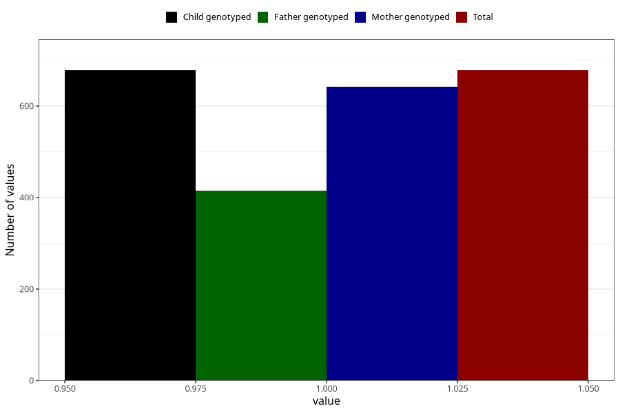

# formula_colett_3m
Variable mapping to `DD59` in `Skjema4_6mnd_v12`.
- Number of values:

| Value | Total | Child genotyped | Mother genotyped | Father genotyped |
| ----- | ----- | --------------- | ---------------- | ---------------- |
| Missing | 80327 | 80327 | 75975 | 53189 |
| Non-missing | 678 | 678 | 642 | 415 |
| 1 | 678 | 678 | 642 | 415 |

