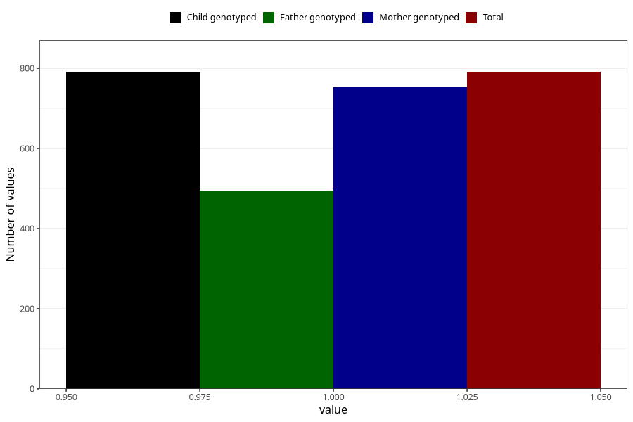

# formula_colett_4m
Variable mapping to `DD60` in `Skjema4_6mnd_v12`.
- Number of values:

| Value | Total | Child genotyped | Mother genotyped | Father genotyped |
| ----- | ----- | --------------- | ---------------- | ---------------- |
| Missing | 80214 | 80214 | 75865 | 53109 |
| Non-missing | 791 | 791 | 752 | 495 |
| 1 | 791 | 791 | 752 | 495 |

