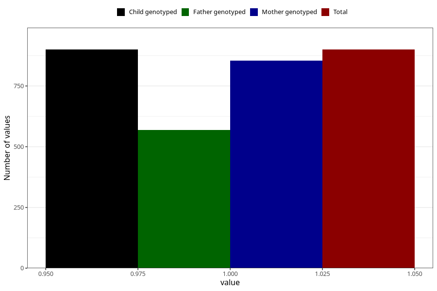

# formula_colett_5m
Variable mapping to `DD61` in `Skjema4_6mnd_v12`.
- Number of values:

| Value | Total | Child genotyped | Mother genotyped | Father genotyped |
| ----- | ----- | --------------- | ---------------- | ---------------- |
| Missing | 80105 | 80105 | 75763 | 53036 |
| Non-missing | 900 | 900 | 854 | 568 |
| 1 | 900 | 900 | 854 | 568 |

