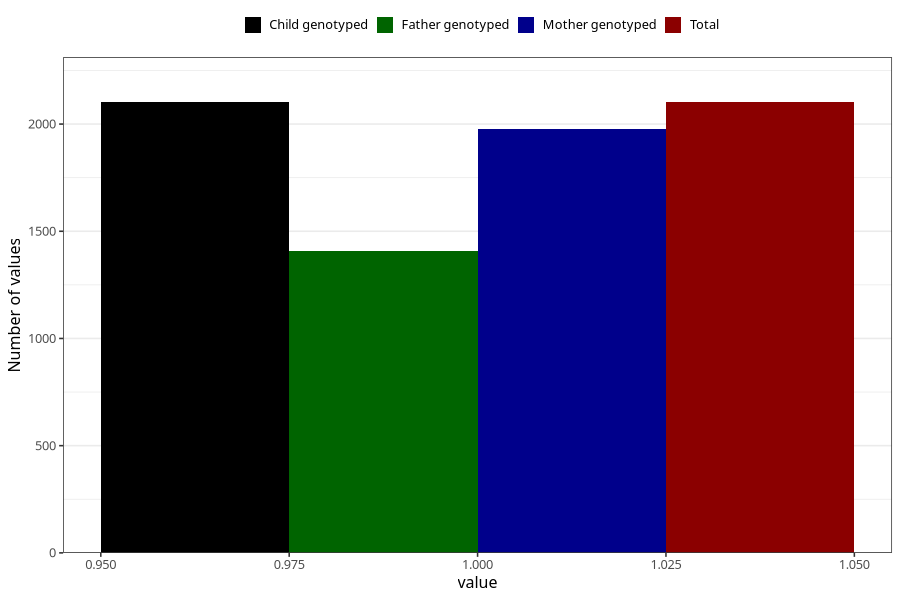

# formula_colett_omega3_0m
Variable mapping to `DD63` in `Skjema4_6mnd_v12`.
- Number of values:

| Value | Total | Child genotyped | Mother genotyped | Father genotyped |
| ----- | ----- | --------------- | ---------------- | ---------------- |
| Missing | 78903 | 78903 | 74638 | 52197 |
| Non-missing | 2102 | 2102 | 1979 | 1407 |
| 1 | 2102 | 2102 | 1979 | 1407 |

