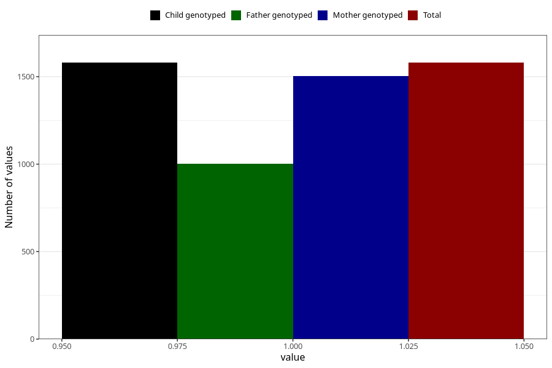

# formula_colett_omega3_1m
Variable mapping to `DD64` in `Skjema4_6mnd_v12`.
- Number of values:

| Value | Total | Child genotyped | Mother genotyped | Father genotyped |
| ----- | ----- | --------------- | ---------------- | ---------------- |
| Missing | 79425 | 79425 | 75112 | 52602 |
| Non-missing | 1580 | 1580 | 1505 | 1002 |
| 1 | 1580 | 1580 | 1505 | 1002 |

