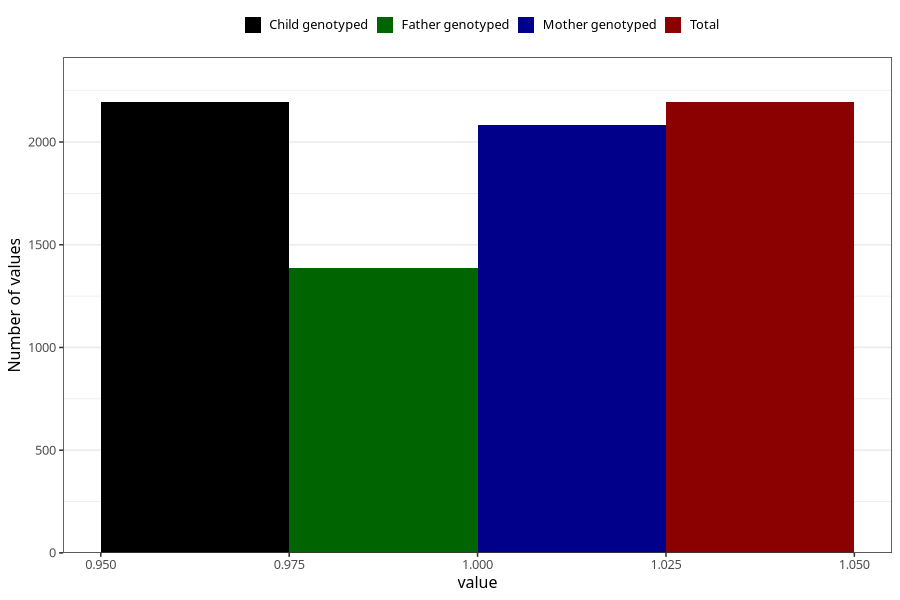

# formula_colett_omega3_2m
Variable mapping to `DD65` in `Skjema4_6mnd_v12`.
- Number of values:

| Value | Total | Child genotyped | Mother genotyped | Father genotyped |
| ----- | ----- | --------------- | ---------------- | ---------------- |
| Missing | 78811 | 78811 | 74534 | 52217 |
| Non-missing | 2194 | 2194 | 2083 | 1387 |
| 1 | 2194 | 2194 | 2083 | 1387 |

