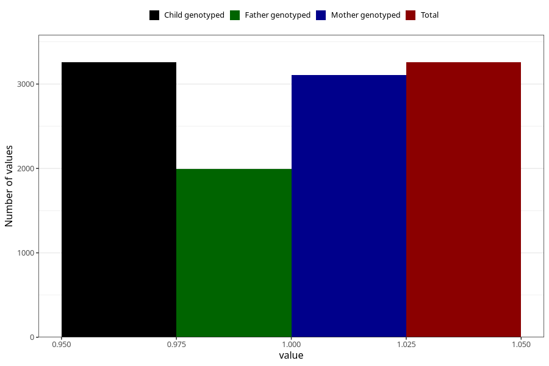

# formula_colett_omega3_4m
Variable mapping to `DD67` in `Skjema4_6mnd_v12`.
- Number of values:

| Value | Total | Child genotyped | Mother genotyped | Father genotyped |
| ----- | ----- | --------------- | ---------------- | ---------------- |
| Missing | 77748 | 77748 | 73511 | 51610 |
| Non-missing | 3257 | 3257 | 3106 | 1994 |
| 1 | 3257 | 3257 | 3106 | 1994 |

