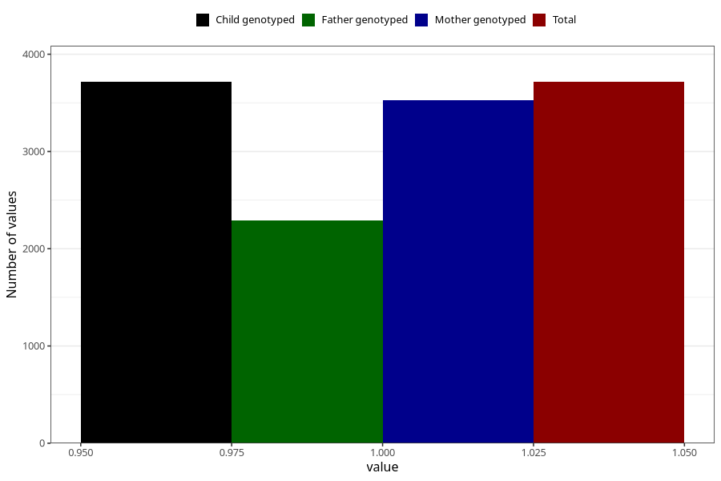

# formula_colett_omega3_5m
Variable mapping to `DD68` in `Skjema4_6mnd_v12`.
- Number of values:

| Value | Total | Child genotyped | Mother genotyped | Father genotyped |
| ----- | ----- | --------------- | ---------------- | ---------------- |
| Missing | 77290 | 77290 | 73092 | 51310 |
| Non-missing | 3715 | 3715 | 3525 | 2294 |
| 1 | 3715 | 3715 | 3525 | 2294 |

