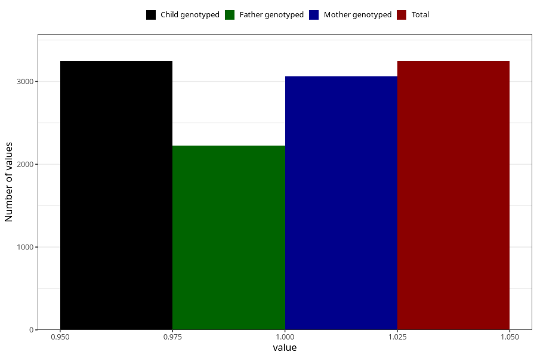

# formula_colett_omega3_6m
Variable mapping to `DD69` in `Skjema4_6mnd_v12`.
- Number of values:

| Value | Total | Child genotyped | Mother genotyped | Father genotyped |
| ----- | ----- | --------------- | ---------------- | ---------------- |
| Missing | 77758 | 77758 | 73554 | 51377 |
| Non-missing | 3247 | 3247 | 3063 | 2227 |
| 1 | 3247 | 3247 | 3063 | 2227 |

