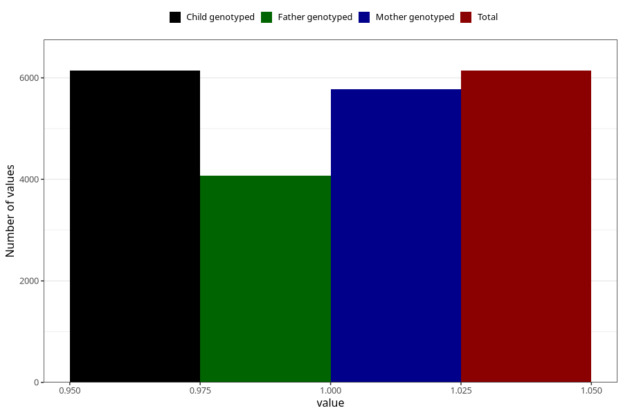

# formula_nan_1m
Variable mapping to `DD71` in `Skjema4_6mnd_v12`.
- Number of values:

| Value | Total | Child genotyped | Mother genotyped | Father genotyped |
| ----- | ----- | --------------- | ---------------- | ---------------- |
| Missing | 74864 | 74864 | 70846 | 49527 |
| Non-missing | 6141 | 6141 | 5771 | 4077 |
| 1 | 6141 | 6141 | 5771 | 4077 |

