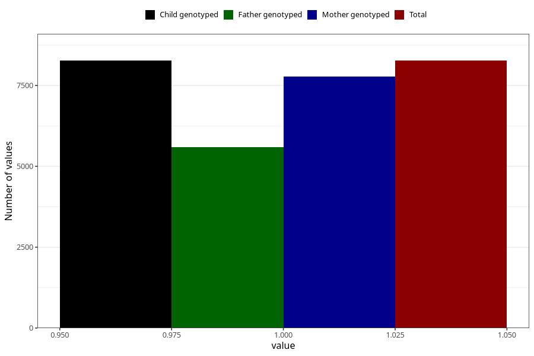

# formula_nan_2m
Variable mapping to `DD72` in `Skjema4_6mnd_v12`.
- Number of values:

| Value | Total | Child genotyped | Mother genotyped | Father genotyped |
| ----- | ----- | --------------- | ---------------- | ---------------- |
| Missing | 72737 | 72737 | 68832 | 48013 |
| Non-missing | 8268 | 8268 | 7785 | 5591 |
| 1 | 8268 | 8268 | 7785 | 5591 |

