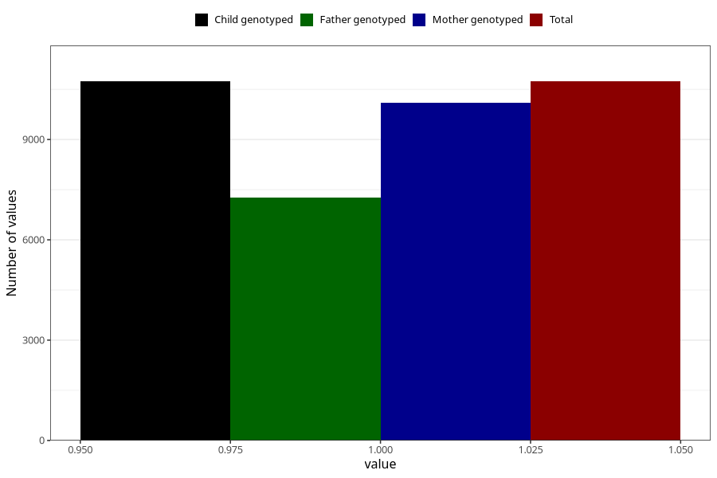

# formula_nan_3m
Variable mapping to `DD73` in `Skjema4_6mnd_v12`.
- Number of values:

| Value | Total | Child genotyped | Mother genotyped | Father genotyped |
| ----- | ----- | --------------- | ---------------- | ---------------- |
| Missing | 70268 | 70268 | 66508 | 46347 |
| Non-missing | 10737 | 10737 | 10109 | 7257 |
| 1 | 10737 | 10737 | 10109 | 7257 |

