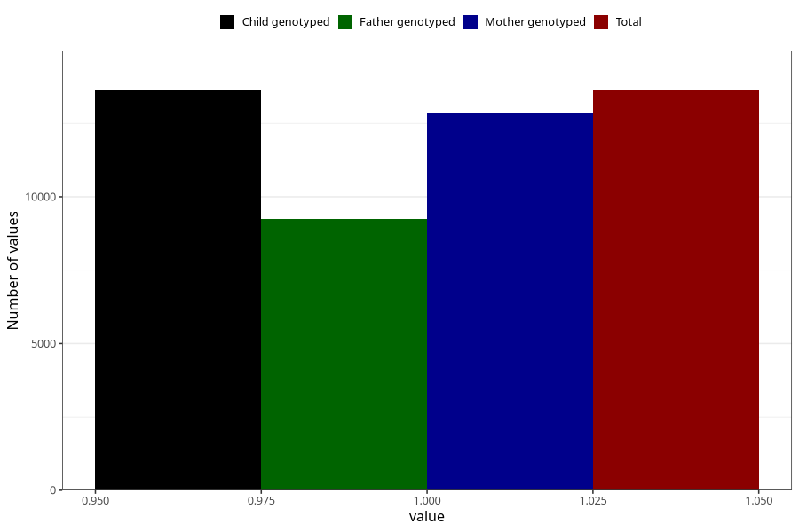

# formula_nan_4m
Variable mapping to `DD74` in `Skjema4_6mnd_v12`.
- Number of values:

| Value | Total | Child genotyped | Mother genotyped | Father genotyped |
| ----- | ----- | --------------- | ---------------- | ---------------- |
| Missing | 67386 | 67386 | 63775 | 44374 |
| Non-missing | 13619 | 13619 | 12842 | 9230 |
| 1 | 13619 | 13619 | 12842 | 9230 |

