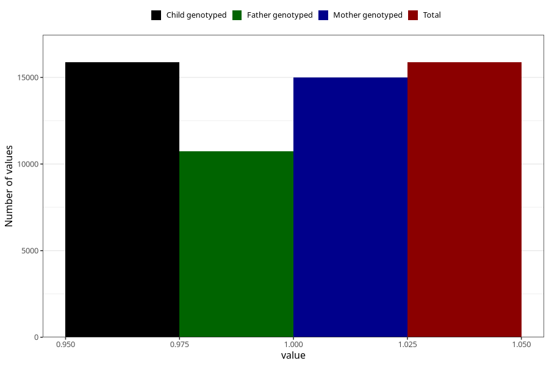

# formula_nan_5m
Variable mapping to `DD75` in `Skjema4_6mnd_v12`.
- Number of values:

| Value | Total | Child genotyped | Mother genotyped | Father genotyped |
| ----- | ----- | --------------- | ---------------- | ---------------- |
| Missing | 65136 | 65136 | 61637 | 42878 |
| Non-missing | 15869 | 15869 | 14980 | 10726 |
| 1 | 15869 | 15869 | 14980 | 10726 |

