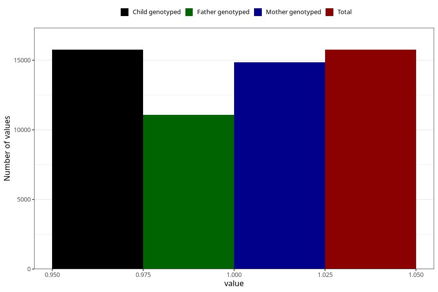

# formula_nan_6m
Variable mapping to `DD76` in `Skjema4_6mnd_v12`.
- Number of values:

| Value | Total | Child genotyped | Mother genotyped | Father genotyped |
| ----- | ----- | --------------- | ---------------- | ---------------- |
| Missing | 65253 | 65253 | 61766 | 42540 |
| Non-missing | 15752 | 15752 | 14851 | 11064 |
| 1 | 15752 | 15752 | 14851 | 11064 |

