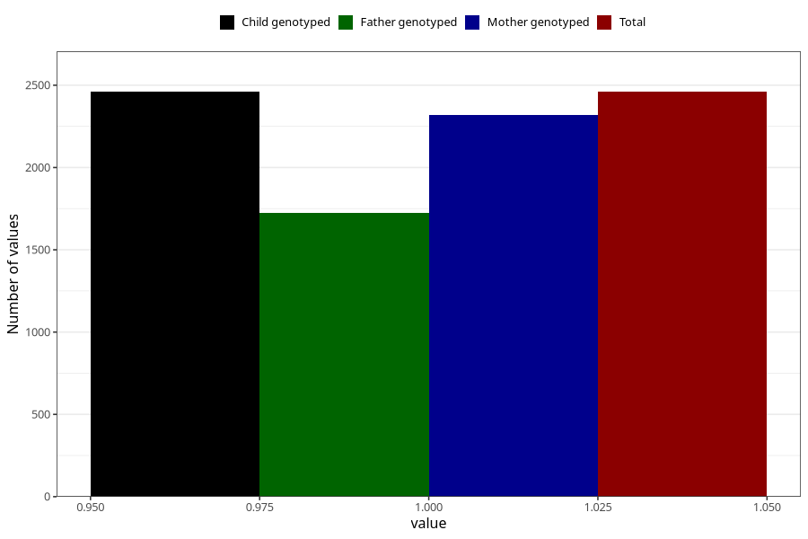

# formula_nan_ha1_0m
Variable mapping to `DD77` in `Skjema4_6mnd_v12`.
- Number of values:

| Value | Total | Child genotyped | Mother genotyped | Father genotyped |
| ----- | ----- | --------------- | ---------------- | ---------------- |
| Missing | 78545 | 78545 | 74296 | 51881 |
| Non-missing | 2460 | 2460 | 2321 | 1723 |
| 1 | 2460 | 2460 | 2321 | 1723 |

