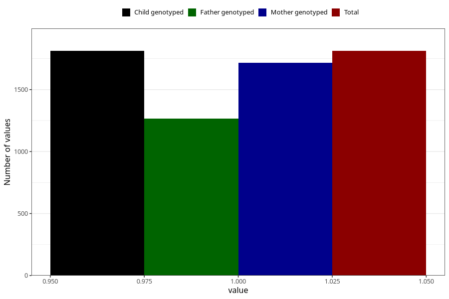

# formula_nan_ha1_1m
Variable mapping to `DD78` in `Skjema4_6mnd_v12`.
- Number of values:

| Value | Total | Child genotyped | Mother genotyped | Father genotyped |
| ----- | ----- | --------------- | ---------------- | ---------------- |
| Missing | 79193 | 79193 | 74900 | 52337 |
| Non-missing | 1812 | 1812 | 1717 | 1267 |
| 1 | 1812 | 1812 | 1717 | 1267 |

