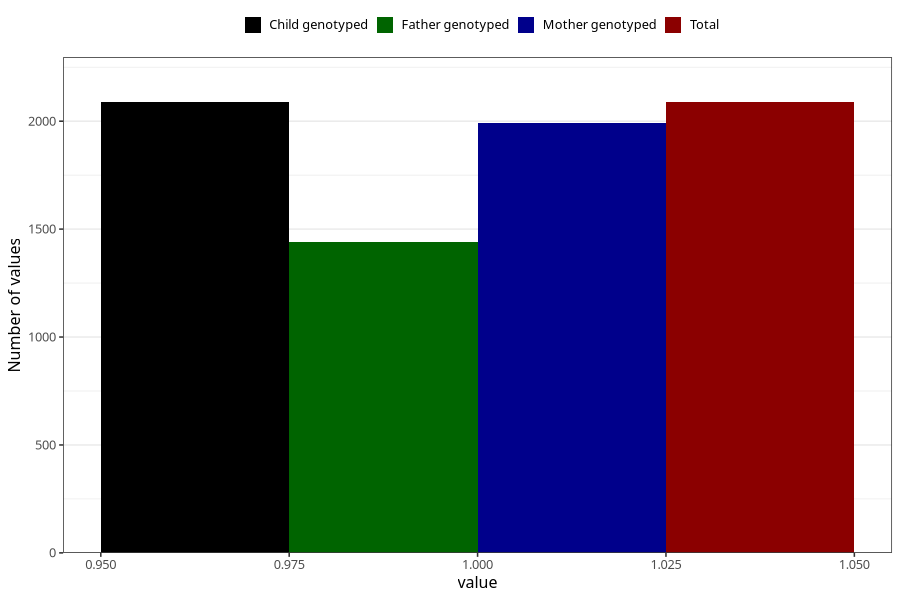

# formula_nan_ha1_2m
Variable mapping to `DD79` in `Skjema4_6mnd_v12`.
- Number of values:

| Value | Total | Child genotyped | Mother genotyped | Father genotyped |
| ----- | ----- | --------------- | ---------------- | ---------------- |
| Missing | 78917 | 78917 | 74624 | 52164 |
| Non-missing | 2088 | 2088 | 1993 | 1440 |
| 1 | 2088 | 2088 | 1993 | 1440 |

