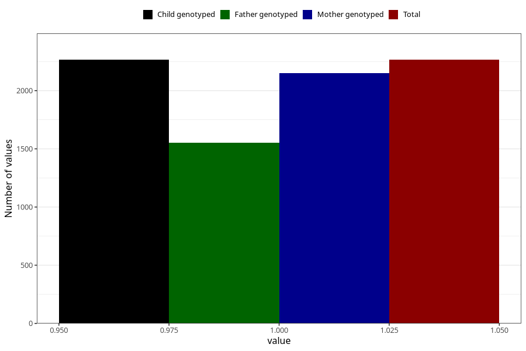

# formula_nan_ha1_3m
Variable mapping to `DD80` in `Skjema4_6mnd_v12`.
- Number of values:

| Value | Total | Child genotyped | Mother genotyped | Father genotyped |
| ----- | ----- | --------------- | ---------------- | ---------------- |
| Missing | 78740 | 78740 | 74468 | 52051 |
| Non-missing | 2265 | 2265 | 2149 | 1553 |
| 1 | 2265 | 2265 | 2149 | 1553 |

