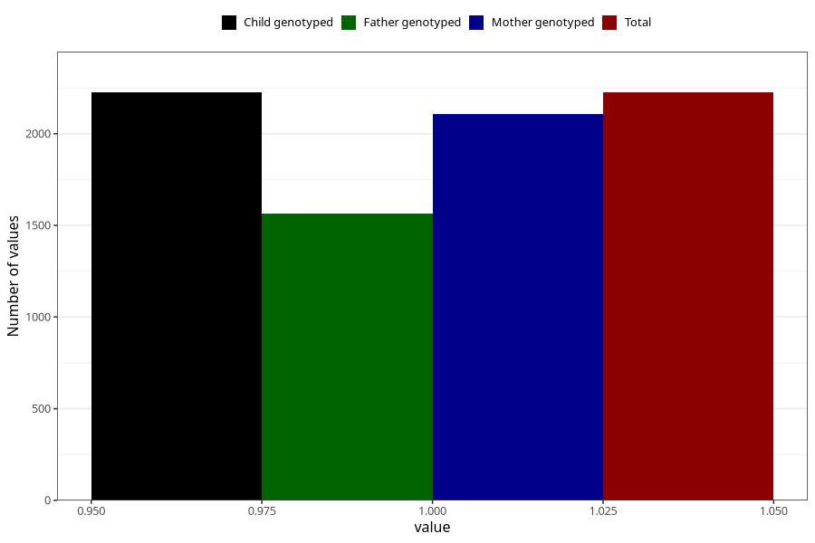

# formula_nan_ha1_4m
Variable mapping to `DD81` in `Skjema4_6mnd_v12`.
- Number of values:

| Value | Total | Child genotyped | Mother genotyped | Father genotyped |
| ----- | ----- | --------------- | ---------------- | ---------------- |
| Missing | 78780 | 78780 | 74509 | 52039 |
| Non-missing | 2225 | 2225 | 2108 | 1565 |
| 1 | 2225 | 2225 | 2108 | 1565 |

