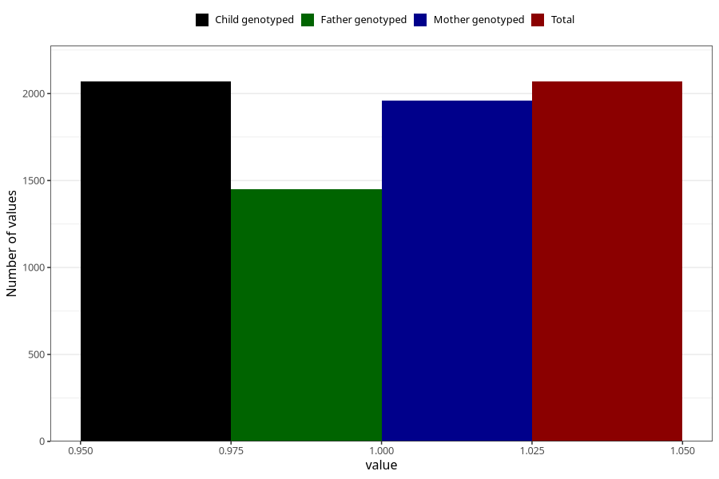

# formula_nan_ha1_5m
Variable mapping to `DD82` in `Skjema4_6mnd_v12`.
- Number of values:

| Value | Total | Child genotyped | Mother genotyped | Father genotyped |
| ----- | ----- | --------------- | ---------------- | ---------------- |
| Missing | 78936 | 78936 | 74659 | 52156 |
| Non-missing | 2069 | 2069 | 1958 | 1448 |
| 1 | 2069 | 2069 | 1958 | 1448 |

