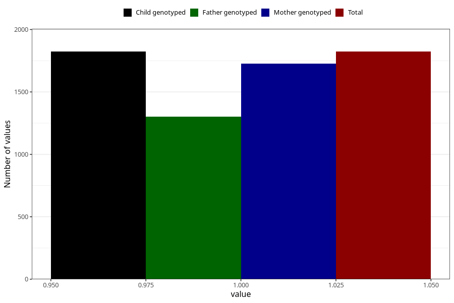

# formula_nan_ha1_6m
Variable mapping to `DD83` in `Skjema4_6mnd_v12`.
- Number of values:

| Value | Total | Child genotyped | Mother genotyped | Father genotyped |
| ----- | ----- | --------------- | ---------------- | ---------------- |
| Missing | 79182 | 79182 | 74891 | 52304 |
| Non-missing | 1823 | 1823 | 1726 | 1300 |
| 1 | 1823 | 1823 | 1726 | 1300 |

