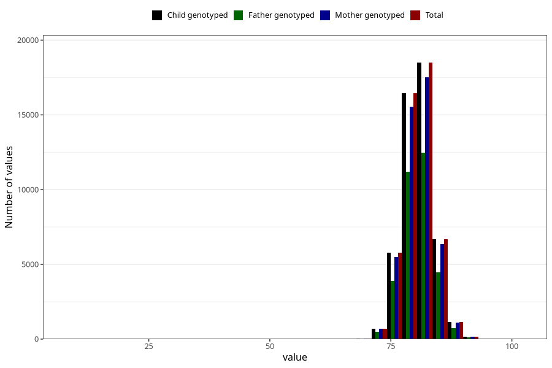

# length_15_18m_1
Variable mapping to `EE399` in `Skjema5_18mnd_v12`.
- Number of values:

| Value | Total | Child genotyped | Mother genotyped | Father genotyped |
| ----- | ----- | --------------- | ---------------- | ---------------- |
| Missing | 31576 | 31576 | 29762 | 20236 |
| Non-missing | 49429 | 49429 | 46855 | 33368 |
| 25th percentile | 78.5 | 78.5 | 78.5 | 78.5 |
| 50th percentile | 80.5 | 80.5 | 80.5 | 80.5 |
| 75th percentile | 82.6 | 82.6 | 82.7 | 82.5 |
| Mean | 80.6802443909446 | 80.6802443909446 | 80.6806744210863 | 80.663195276912 |
| Standard deviation | 3.12064771340254 | 3.12064771340254 | 3.1315959396883 | 3.06465317507755 |
| N | 49429 | 49429 | 46855 | 33368 |

