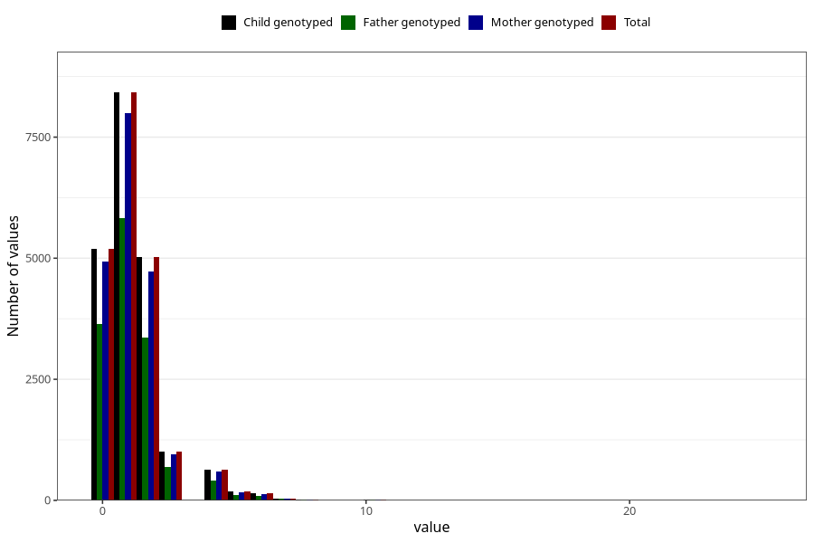

# n_slices_crisp_bread_7y
Variable mapping to `JJ342` in `Skjema7aar_v12`.
- Number of values:

| Value | Total | Child genotyped | Mother genotyped | Father genotyped |
| ----- | ----- | --------------- | ---------------- | ---------------- |
| Missing | 60307 | 60307 | 57015 | 39410 |
| Non-missing | 20698 | 20698 | 19602 | 14194 |
| 0 | 5193 | 5193 | 4939 | 3641 |
| 1 | 8422 | 8422 | 8002 | 5819 |
| 2 | 5025 | 5025 | 4732 | 3370 |
| 3 | 1011 | 1011 | 954 | 694 |
| 4 | 639 | 639 | 596 | 404 |
| 5 | 179 | 179 | 164 | 119 |
| 6 | 141 | 141 | 132 | 85 |
| 7 | 38 | 38 | 36 | 26 |
| 8 | 24 | 24 | 22 | 15 |
| 9 | 4 | 4 | 4 | 3 |
| 10 | 9 | 9 | 9 | 8 |
| 11 | 1 | 1 | 1 | 1 |
| 12 | 2 | 2 | 2 | 2 |
| 14 | 4 | 4 | 4 | 3 |
| 15 | 1 | 1 | 0 | 0 |
| 16 | 1 | 1 | 1 | 1 |
| 20 | 3 | 3 | 3 | 2 |
| 25 | 1 | 1 | 1 | 1 |

