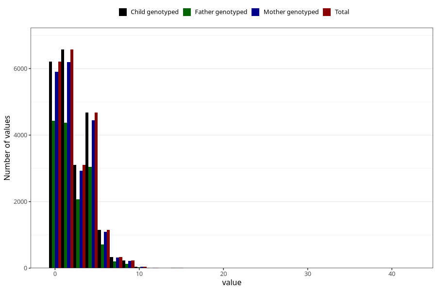

# n_slices_medium_refined_bread_daily_7y
Variable mapping to `JJ340` in `Skjema7aar_v12`.
- Number of values:

| Value | Total | Child genotyped | Mother genotyped | Father genotyped |
| ----- | ----- | --------------- | ---------------- | ---------------- |
| Missing | 58678 | 58678 | 55480 | 38587 |
| Non-missing | 22327 | 22327 | 21137 | 15017 |
| 25th percentile | 0 | 0 | 0 | 0 |
| 50th percentile | 2 | 2 | 2 | 2 |
| 75th percentile | 4 | 4 | 4 | 4 |
| Mean | 2.3362296770726 | 2.3362296770726 | 2.33737048777026 | 2.25258040886995 |
| Standard deviation | 2.09360505138398 | 2.09360505138398 | 2.09482811652855 | 2.06621480991861 |
| N | 22327 | 22327 | 21137 | 15017 |

