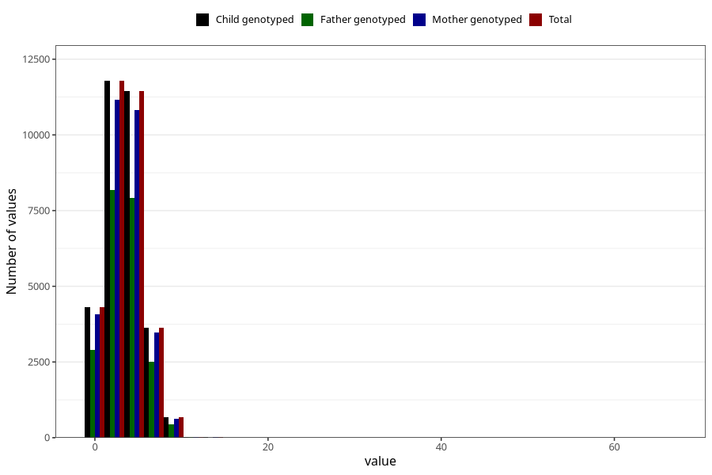

# n_slices_whole_grain_bread_7y
Variable mapping to `JJ341` in `Skjema7aar_v12`.
- Number of values:

| Value | Total | Child genotyped | Mother genotyped | Father genotyped |
| ----- | ----- | --------------- | ---------------- | ---------------- |
| Missing | 49098 | 49098 | 46416 | 31582 |
| Non-missing | 31907 | 31907 | 30201 | 22022 |
| 25th percentile | 2 | 2 | 2 | 2 |
| 50th percentile | 3 | 3 | 3 | 3 |
| 75th percentile | 5 | 5 | 5 | 5 |
| Mean | 3.48719716676591 | 3.48719716676591 | 3.48998377537168 | 3.49709381527563 |
| Standard deviation | 1.99261722713124 | 1.99261722713124 | 1.99671269652196 | 1.95857969505407 |
| N | 31907 | 31907 | 30201 | 22022 |

