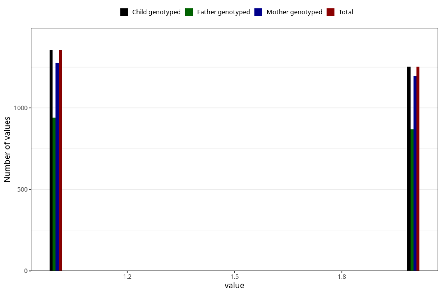

# omega3_capsules_amount_per_time_7y
Variable mapping to `JJ533` in `Skjema7aar_v12`.
Variable mapping to `JJ533` in `Skjema7aar_v12`.
- Number of values:

| Value | Total | Child genotyped | Mother genotyped | Father genotyped |
| ----- | ----- | --------------- | ---------------- | ---------------- |
| Missing | 78295 | 78295 | 74046 | 51723 |
| Non-missing | 2710 | 2710 | 2571 | 1881 |
| 3+ at a time | 102 | 102 | 97 |70 |
| More than 1 check box filled in | 1 | 1 | 1 |1 |
| 1 | 1355 | 1355 | 1276 | 940 |
| 2 | 1252 | 1252 | 1197 | 870 |

