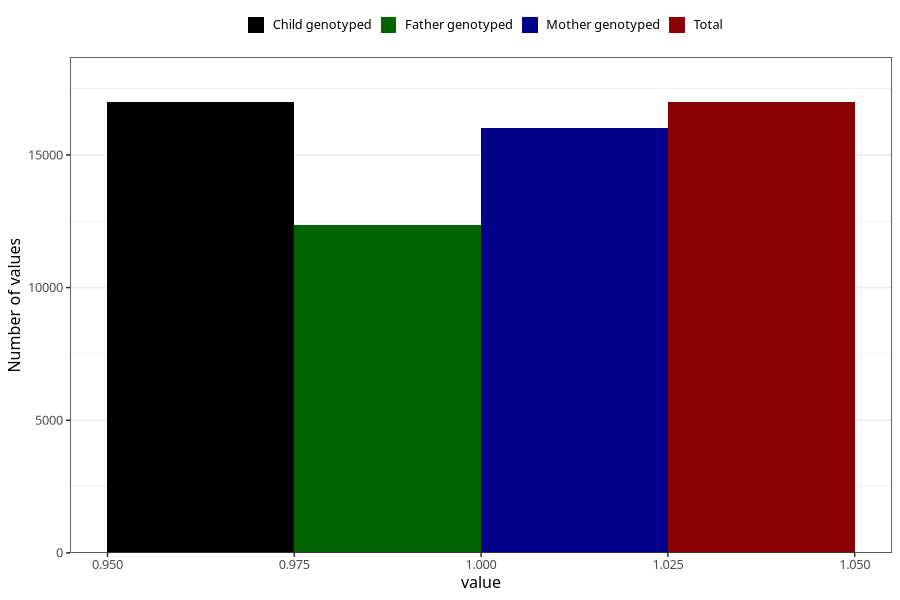

# omega3_liquid_5y
Variable mapping to `LL472` in `Skjema5aar_v12`.
- Number of values:

| Value | Total | Child genotyped | Mother genotyped | Father genotyped |
| ----- | ----- | --------------- | ---------------- | ---------------- |
| Missing | 64017 | 64017 | 60601 | 41232 |
| Non-missing | 16988 | 16988 | 16016 | 12372 |
| 1 | 16988 | 16988 | 16016 | 12372 |

