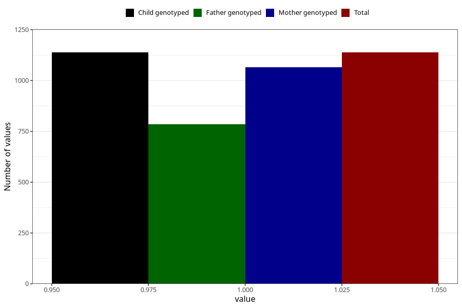

# other_milk_0m
Variable mapping to `DD84` in `Skjema4_6mnd_v12`.
- Number of values:

| Value | Total | Child genotyped | Mother genotyped | Father genotyped |
| ----- | ----- | --------------- | ---------------- | ---------------- |
| Missing | 79867 | 79867 | 75552 | 52818 |
| Non-missing | 1138 | 1138 | 1065 | 786 |
| 1 | 1138 | 1138 | 1065 | 786 |

