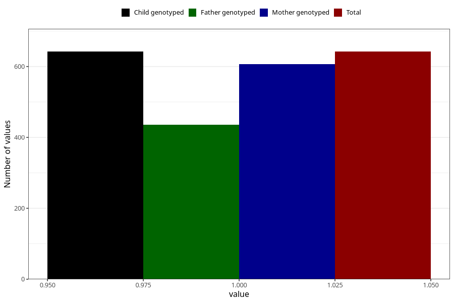

# other_milk_1m
Variable mapping to `DD85` in `Skjema4_6mnd_v12`.
- Number of values:

| Value | Total | Child genotyped | Mother genotyped | Father genotyped |
| ----- | ----- | --------------- | ---------------- | ---------------- |
| Missing | 80363 | 80363 | 76011 | 53168 |
| Non-missing | 642 | 642 | 606 | 436 |
| 1 | 642 | 642 | 606 | 436 |

