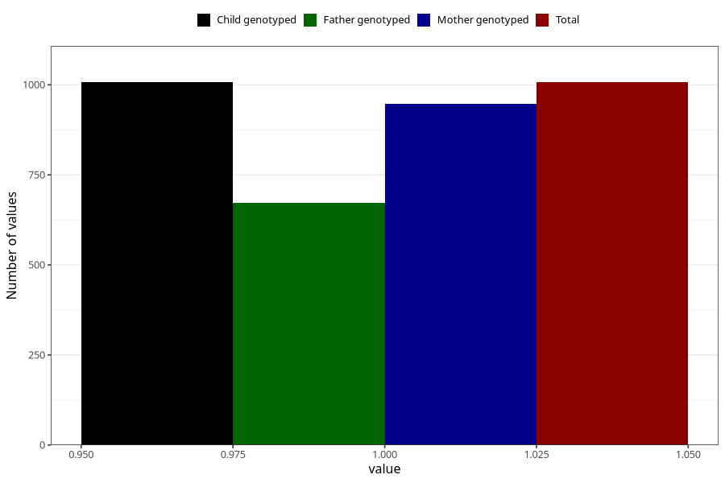

# other_milk_2m
Variable mapping to `DD86` in `Skjema4_6mnd_v12`.
- Number of values:

| Value | Total | Child genotyped | Mother genotyped | Father genotyped |
| ----- | ----- | --------------- | ---------------- | ---------------- |
| Missing | 79998 | 79998 | 75670 | 52931 |
| Non-missing | 1007 | 1007 | 947 | 673 |
| 1 | 1007 | 1007 | 947 | 673 |

