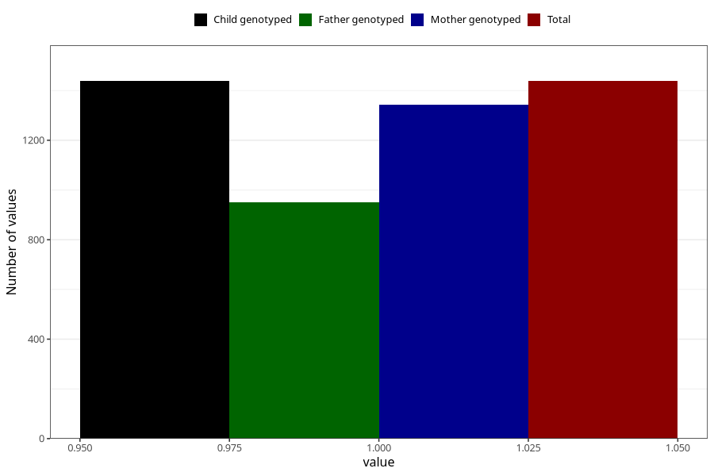

# other_milk_3m
Variable mapping to `DD87` in `Skjema4_6mnd_v12`.
- Number of values:

| Value | Total | Child genotyped | Mother genotyped | Father genotyped |
| ----- | ----- | --------------- | ---------------- | ---------------- |
| Missing | 79567 | 79567 | 75274 | 52653 |
| Non-missing | 1438 | 1438 | 1343 | 951 |
| 1 | 1438 | 1438 | 1343 | 951 |

