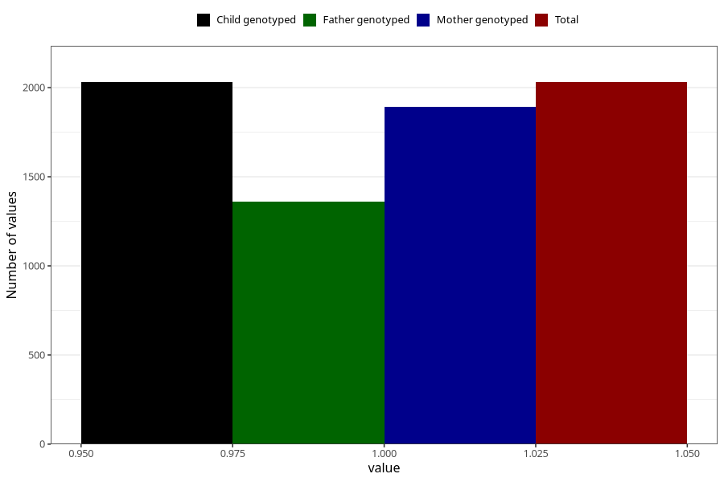

# other_milk_4m
Variable mapping to `DD88` in `Skjema4_6mnd_v12`.
- Number of values:

| Value | Total | Child genotyped | Mother genotyped | Father genotyped |
| ----- | ----- | --------------- | ---------------- | ---------------- |
| Missing | 78974 | 78974 | 74726 | 52243 |
| Non-missing | 2031 | 2031 | 1891 | 1361 |
| 1 | 2031 | 2031 | 1891 | 1361 |

