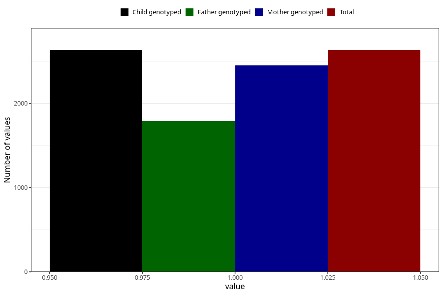

# other_milk_5m
Variable mapping to `DD89` in `Skjema4_6mnd_v12`.
- Number of values:

| Value | Total | Child genotyped | Mother genotyped | Father genotyped |
| ----- | ----- | --------------- | ---------------- | ---------------- |
| Missing | 78375 | 78375 | 74164 | 51811 |
| Non-missing | 2630 | 2630 | 2453 | 1793 |
| 1 | 2630 | 2630 | 2453 | 1793 |

