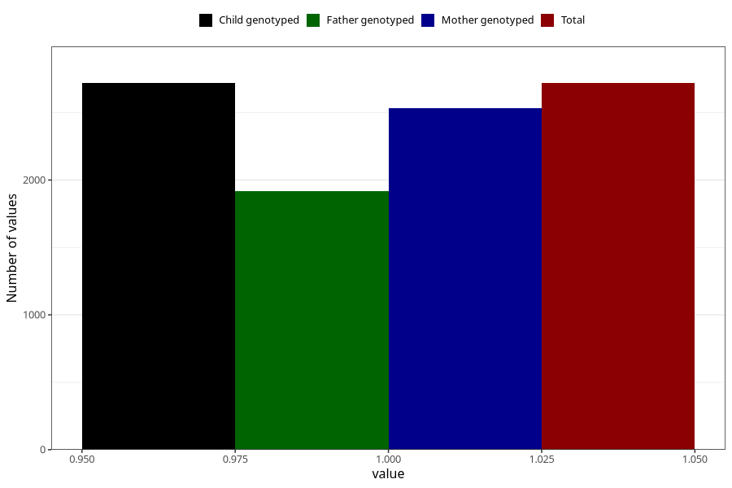

# other_milk_6m
Variable mapping to `DD90` in `Skjema4_6mnd_v12`.
- Number of values:

| Value | Total | Child genotyped | Mother genotyped | Father genotyped |
| ----- | ----- | --------------- | ---------------- | ---------------- |
| Missing | 78286 | 78286 | 74084 | 51686 |
| Non-missing | 2719 | 2719 | 2533 | 1918 |
| 1 | 2719 | 2719 | 2533 | 1918 |

