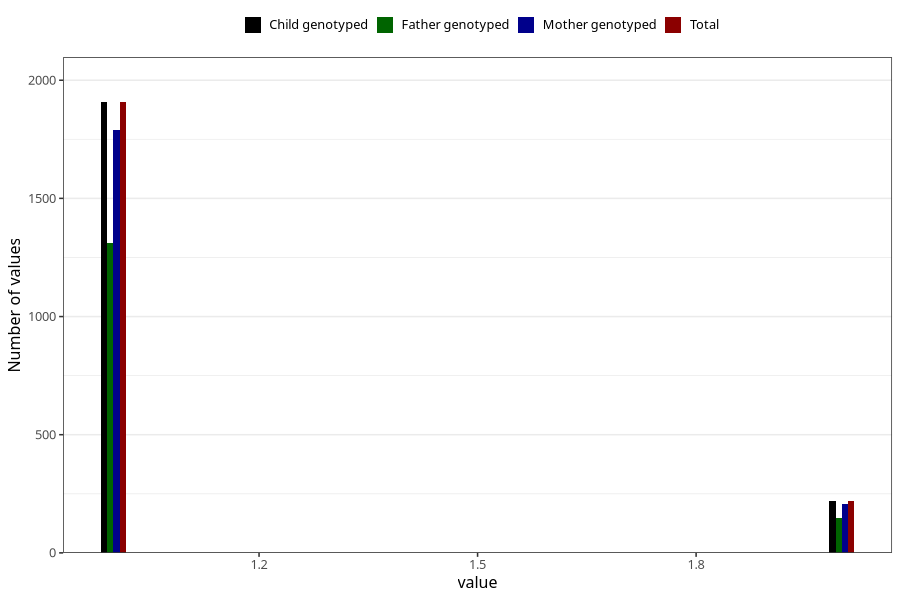

# other_supplement_capsules_amount_per_time_7y
Variable mapping to `JJ542` in `Skjema7aar_v12`.
Variable mapping to `JJ542` in `Skjema7aar_v12`.
- Number of values:

| Value | Total | Child genotyped | Mother genotyped | Father genotyped |
| ----- | ----- | --------------- | ---------------- | ---------------- |
| Missing | 78821 | 78821 | 74568 | 52112 |
| Non-missing | 2184 | 2184 | 2049 | 1492 |
| 3+ at a time | 54 | 54 | 50 |33 |
| More than 1 check box filled in | 2 | 2 | 2 |2 |
| 1 | 1907 | 1907 | 1789 | 1311 |
| 2 | 221 | 221 | 208 | 146 |

