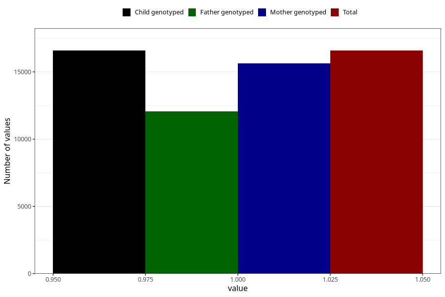

# other_supplement_liquid_5y
Variable mapping to `LL474` in `Skjema5aar_v12`.
- Number of values:

| Value | Total | Child genotyped | Mother genotyped | Father genotyped |
| ----- | ----- | --------------- | ---------------- | ---------------- |
| Missing | 64421 | 64421 | 60971 | 41535 |
| Non-missing | 16584 | 16584 | 15646 | 12069 |
| 1 | 16584 | 16584 | 15646 | 12069 |

