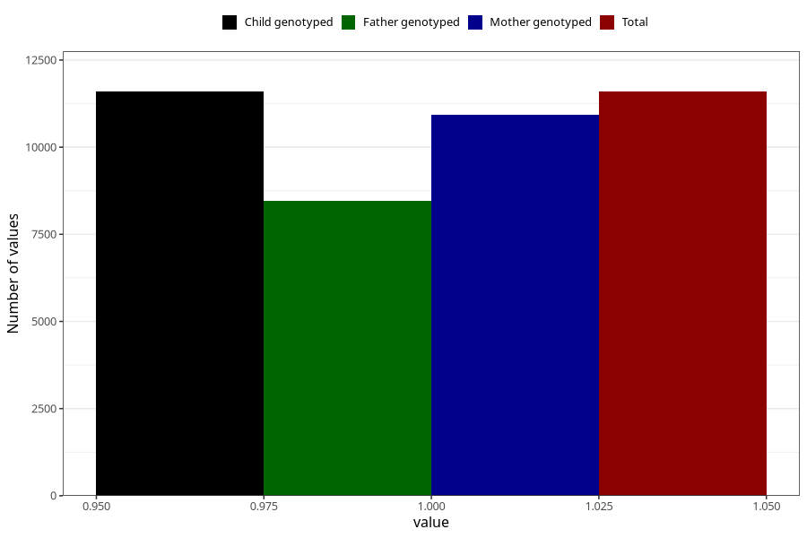

# sanasol_biocit_liquid_5y
Variable mapping to `LL473` in `Skjema5aar_v12`.
- Number of values:

| Value | Total | Child genotyped | Mother genotyped | Father genotyped |
| ----- | ----- | --------------- | ---------------- | ---------------- |
| Missing | 69412 | 69412 | 65693 | 45141 |
| Non-missing | 11593 | 11593 | 10924 | 8463 |
| 1 | 11593 | 11593 | 10924 | 8463 |

