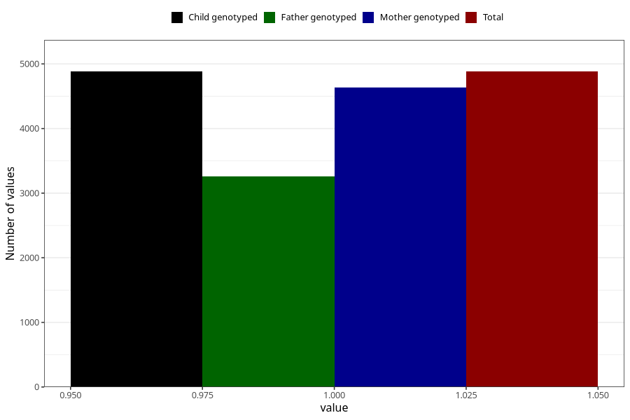

# sugarwater_first_week
Variable mapping to `DD44` in `Skjema4_6mnd_v12`.
- Number of values:

| Value | Total | Child genotyped | Mother genotyped | Father genotyped |
| ----- | ----- | --------------- | ---------------- | ---------------- |
| Missing | 76123 | 76123 | 71987 | 50344 |
| Non-missing | 4882 | 4882 | 4630 | 3260 |
| 1 | 4882 | 4882 | 4630 | 3260 |

