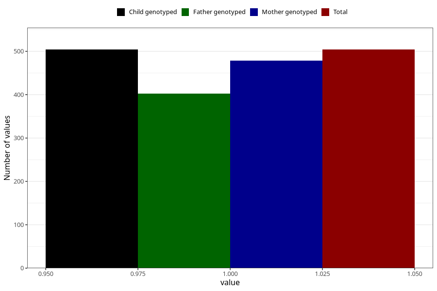

# father_diabetes
Variable mapping to `FF149` in `SkjemaFar_v12`.
- Number of values:

| Value | Total | Child genotyped | Mother genotyped | Father genotyped |
| ----- | ----- | --------------- | ---------------- | ---------------- |
| Missing | 80501 | 80501 | 76138 | 53201 |
| Non-missing | 504 | 504 | 479 | 403 |
| 1 | 504 | 504 | 479 | 403 |

