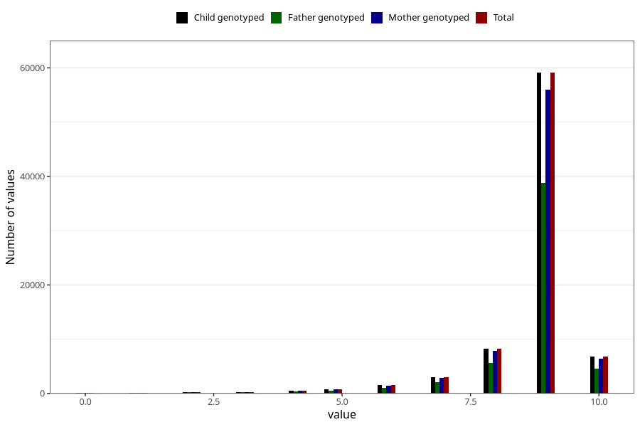

# apgar_1
Variable mapping to `APGAR1` in `MFR_541_v12`.
- Number of values:

| Value | Total | Child genotyped | Mother genotyped | Father genotyped |
| ----- | ----- | --------------- | ---------------- | ---------------- |
| Missing | 160 | 160 | 151 | 98 |
| Non-missing | 80845 | 80845 | 76466 | 53506 |
| 0 | 94 | 94 | 89 | 63 |
| 1 | 135 | 135 | 124 | 90 |
| 2 | 254 | 254 | 238 | 185 |
| 3 | 310 | 310 | 292 | 225 |
| 4 | 509 | 509 | 483 | 334 |
| 5 | 821 | 821 | 791 | 555 |
| 6 | 1559 | 1559 | 1459 | 1018 |
| 7 | 2990 | 2990 | 2829 | 2055 |
| 8 | 8289 | 8289 | 7832 | 5564 |
| 9 | 59106 | 59106 | 55928 | 38842 |
| 10 | 6778 | 6778 | 6401 | 4575 |

