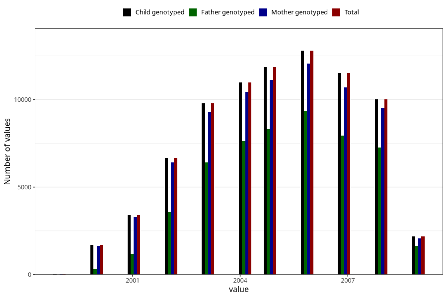

# birth_year
Variable mapping to `FAAR` in `MFR_541_v12`.
- Number of values:

| Value | Total | Child genotyped | Mother genotyped | Father genotyped |
| ----- | ----- | --------------- | ---------------- | ---------------- |
| Missing | 66 | 66 | 61 | 44 |
| Non-missing | 80939 | 80939 | 76556 | 53560 |
| 1999 | 29 | 29 | 27 | 6 |
| 2000 | 1685 | 1685 | 1637 | 295 |
| 2001 | 3409 | 3409 | 3276 | 1176 |
| 2002 | 6678 | 6678 | 6411 | 3577 |
| 2003 | 9791 | 9791 | 9297 | 6399 |
| 2004 | 10984 | 10984 | 10451 | 7635 |
| 2005 | 11854 | 11854 | 11133 | 8308 |
| 2006 | 12789 | 12789 | 12067 | 9335 |
| 2007 | 11514 | 11514 | 10683 | 7942 |
| 2008 | 10014 | 10014 | 9507 | 7258 |
| 2009 | 2192 | 2192 | 2067 | 1629 |

