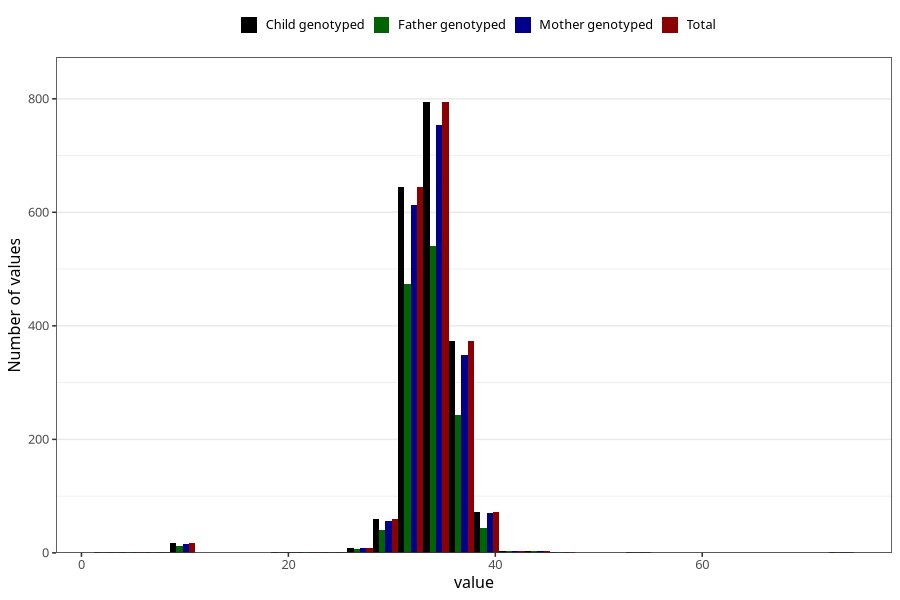

# crown_rump_length
Variable mapping to `SETE_ISSE` in `MFR_541_v12`.
- Number of values:

| Value | Total | Child genotyped | Mother genotyped | Father genotyped |
| ----- | ----- | --------------- | ---------------- | ---------------- |
| Missing | 79015 | 79015 | 74729 | 52227 |
| Non-missing | 1990 | 1990 | 1888 | 1377 |
| 25th percentile | 33 | 33 | 33 | 33 |
| 50th percentile | 34 | 34 | 34 | 34 |
| 75th percentile | 35 | 35 | 35 | 35 |
| Mean | 33.9125628140703 | 33.9125628140703 | 33.9073093220339 | 33.8184458968773 |
| Standard deviation | 3.50886157712798 | 3.50886157712798 | 3.53413059053075 | 3.72029040054719 |
| N | 1990 | 1990 | 1888 | 1377 |

