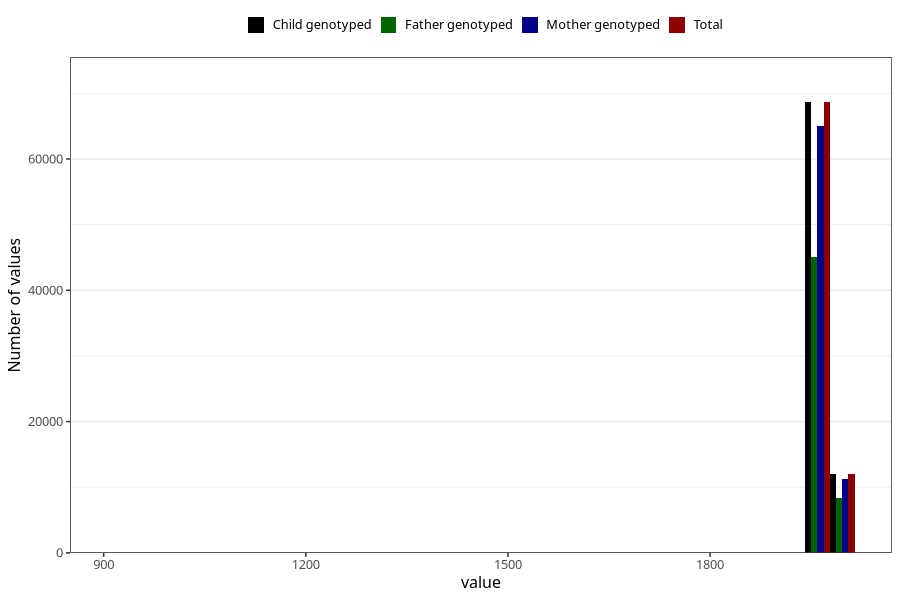

# father_birth_year
Variable mapping to `far_faar_trunkert` in `MFR_541_v12`.
- Number of values:

| Value | Total | Child genotyped | Mother genotyped | Father genotyped |
| ----- | ----- | --------------- | ---------------- | ---------------- |
| Missing | 248 | 248 | 226 | 58 |
| Non-missing | 80757 | 80757 | 76391 | 53546 |
| 25th percentile | 1968 | 1968 | 1968 | 1969 |
| 50th percentile | 1972 | 1972 | 1972 | 1973 |
| 75th percentile | 1976 | 1976 | 1976 | 1976 |
| Mean | 1971.23013484899 | 1971.23013484899 | 1971.20563940778 | 1971.99396780338 |
| Standard deviation | 25.2036865427045 | 25.2036865427045 | 25.0433149074645 | 16.112045265717 |
| N | 80757 | 80757 | 76391 | 53546 |

