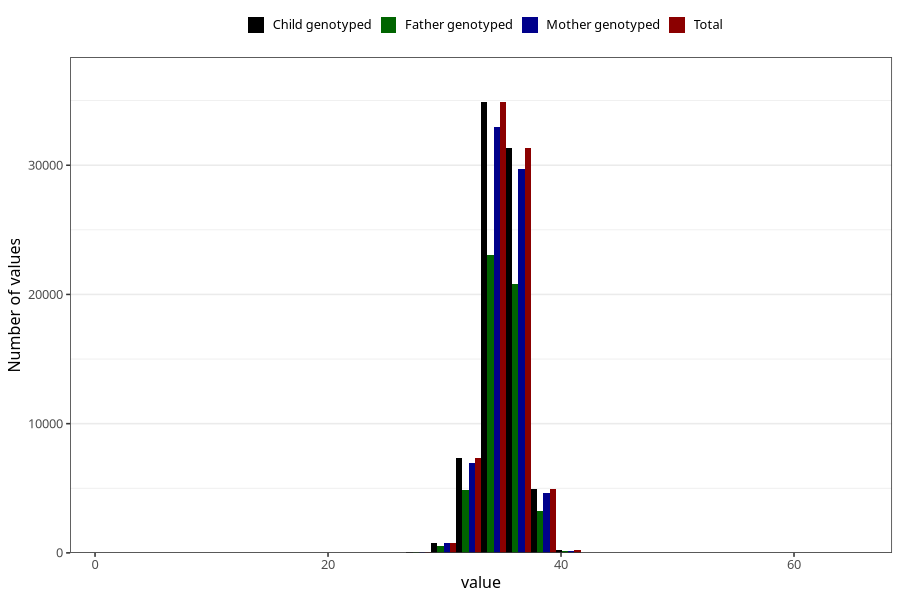

# hc_birth
Variable mapping to `HODE` in `MFR_541_v12`.
- Number of values:

| Value | Total | Child genotyped | Mother genotyped | Father genotyped |
| ----- | ----- | --------------- | ---------------- | ---------------- |
| Missing | 1323 | 1323 | 1238 | 885 |
| Non-missing | 79682 | 79682 | 75379 | 52719 |
| 25th percentile | 34 | 34 | 34 | 34 |
| 50th percentile | 35 | 35 | 35 | 35 |
| 75th percentile | 36 | 36 | 36 | 36 |
| Mean | 35.3037825355789 | 35.3037825355789 | 35.3027501028138 | 35.3020922248146 |
| Standard deviation | 1.62915358026252 | 1.62915358026252 | 1.63317975955973 | 1.62869857222941 |
| N | 79682 | 79682 | 75379 | 52719 |

