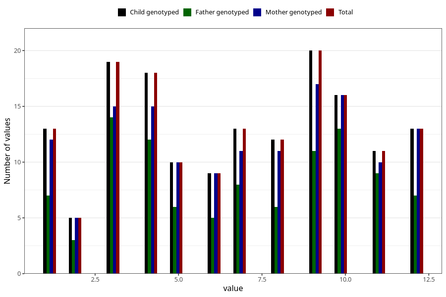

# month_death_child
Variable mapping to `DMND` in `MFR_541_v12`.
- Number of values:

| Value | Total | Child genotyped | Mother genotyped | Father genotyped |
| ----- | ----- | --------------- | ---------------- | ---------------- |
| Missing | 80846 | 80846 | 76473 | 53503 |
| Non-missing | 159 | 159 | 144 | 101 |
| 1 | 13 | 13 | 12 | 7 |
| 2 | 5 | 5 | 5 | 3 |
| 3 | 19 | 19 | 15 | 14 |
| 4 | 18 | 18 | 15 | 12 |
| 5 | 10 | 10 | 10 | 6 |
| 6 | 9 | 9 | 9 | 5 |
| 7 | 13 | 13 | 11 | 8 |
| 8 | 12 | 12 | 11 | 6 |
| 9 | 20 | 20 | 17 | 11 |
| 10 | 16 | 16 | 16 | 13 |
| 11 | 11 | 11 | 10 | 9 |
| 12 | 13 | 13 | 13 | 7 |

