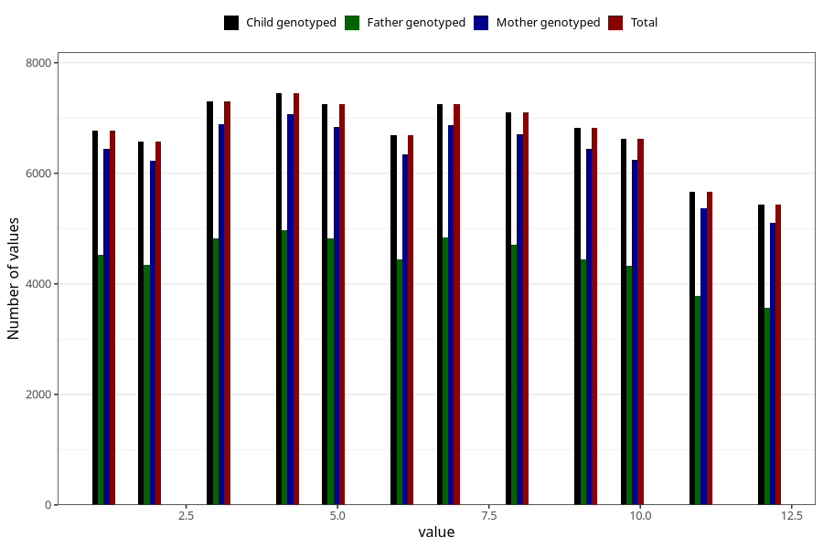

# month_of_delivery
Variable mapping to `FMND` in `MFR_541_v12`.
- Number of values:

| Value | Total | Child genotyped | Mother genotyped | Father genotyped |
| ----- | ----- | --------------- | ---------------- | ---------------- |
| Missing | 66 | 66 | 61 | 44 |
| Non-missing | 80939 | 80939 | 76556 | 53560 |
| 1 | 6775 | 6775 | 6440 | 4525 |
| 2 | 6576 | 6576 | 6232 | 4337 |
| 3 | 7303 | 7303 | 6890 | 4817 |
| 4 | 7446 | 7446 | 7072 | 4971 |
| 5 | 7247 | 7247 | 6846 | 4815 |
| 6 | 6695 | 6695 | 6341 | 4437 |
| 7 | 7249 | 7249 | 6872 | 4842 |
| 8 | 7107 | 7107 | 6702 | 4705 |
| 9 | 6823 | 6823 | 6448 | 4441 |
| 10 | 6619 | 6619 | 6235 | 4329 |
| 11 | 5671 | 5671 | 5373 | 3776 |
| 12 | 5428 | 5428 | 5105 | 3565 |

