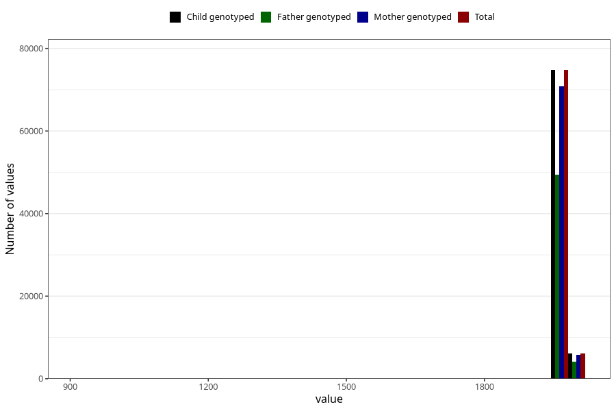

# mother_birth_year
Variable mapping to `mor_faar_trunkert` in `MFR_541_v12`.
- Number of values:

| Value | Total | Child genotyped | Mother genotyped | Father genotyped |
| ----- | ----- | --------------- | ---------------- | ---------------- |
| Missing | 66 | 66 | 61 | 44 |
| Non-missing | 80939 | 80939 | 76556 | 53560 |
| 25th percentile | 1971 | 1971 | 1971 | 1971 |
| 50th percentile | 1974 | 1974 | 1974 | 1975 |
| 75th percentile | 1978 | 1978 | 1978 | 1978 |
| Mean | 1973.96703690434 | 1973.96703690434 | 1973.92568838497 | 1974.28131067961 |
| Standard deviation | 21.0984936368713 | 21.0984936368713 | 21.3384482610942 | 20.8170952197388 |
| N | 80939 | 80939 | 76556 | 53560 |

