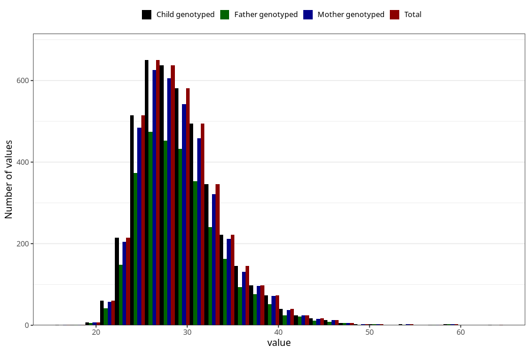

# mother_bmi_end
Variable mapping to `KMI_SLUTT` in `MFR_541_v12`.
- Number of values:

| Value | Total | Child genotyped | Mother genotyped | Father genotyped |
| ----- | ----- | --------------- | ---------------- | ---------------- |
| Missing | 76845 | 76845 | 72688 | 50620 |
| Non-missing | 4160 | 4160 | 3929 | 2984 |
| 25th percentile | 26.03 | 26.03 | 26.03 | 26.03 |
| 50th percentile | 28.63 | 28.63 | 28.58 | 28.63 |
| 75th percentile | 31.7475 | 31.7475 | 31.77 | 31.6325 |
| Mean | 29.3233725961538 | 29.3233725961538 | 29.3114125731738 | 29.3154121983914 |
| Standard deviation | 4.67674951757377 | 4.67674951757377 | 4.67640024610453 | 4.66204377858339 |
| N | 4160 | 4160 | 3929 | 2984 |

