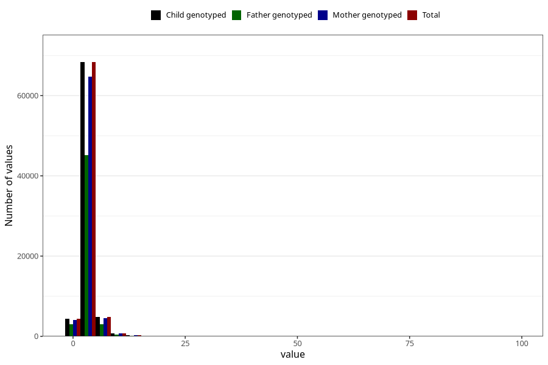

# mother_days_hospital_birth
Variable mapping to `LIGGEDOGN_MOR` in `MFR_541_v12`.
- Number of values:

| Value | Total | Child genotyped | Mother genotyped | Father genotyped |
| ----- | ----- | --------------- | ---------------- | ---------------- |
| Missing | 2474 | 2474 | 2291 | 1702 |
| Non-missing | 78531 | 78531 | 74326 | 51902 |
| 25th percentile | 3 | 3 | 3 | 2 |
| 50th percentile | 3 | 3 | 3 | 3 |
| 75th percentile | 4 | 4 | 4 | 4 |
| Mean | 3.44996243521667 | 3.44996243521667 | 3.45395958345666 | 3.39826981619205 |
| Standard deviation | 2.08417700867853 | 2.08417700867853 | 2.09842556165364 | 2.10830964288644 |
| N | 78531 | 78531 | 74326 | 51902 |

